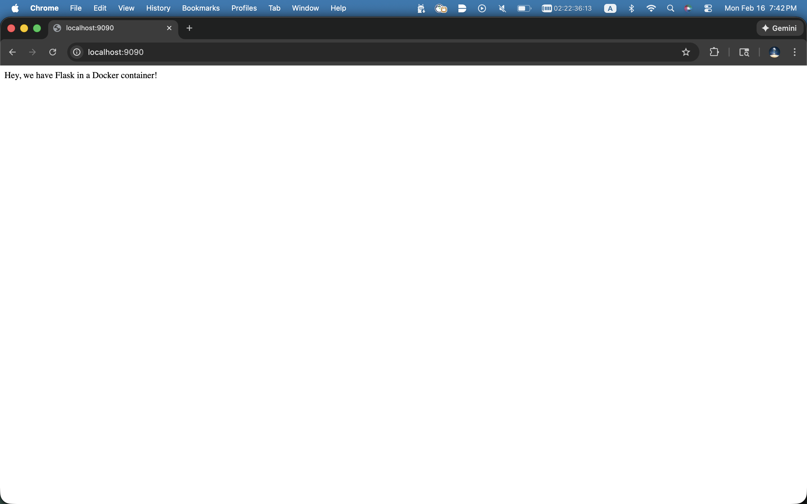

# 🐳 Flask in a Docker Container

## What's in here

A simple Flask web app that runs inside a Docker container on a remote Linux server, accessible via SSH port forwarding.

## The real homework

The assignment was less about writing Flask code and more about surviving Docker errors. The real challenges were:

- **Dependency hell** — Flask 0.10.1 from 2013 does not play nicely with modern pip. Ancient versions need ancient companions (looking at you, Werkzeug 0.9.6 and MarkupSafe 0.23).
- **Python 2 vs the modern world** — Ubuntu 16.04 ships with pip 8.1.1.
- **The SSH tunnel saga** — Getting `localhost:8080 → server:1103 → Docker:5000 → Flask` to all line up took more attempts than expected.

